# NASA APOD ETL Pipeline with Apache Airflow

## Introduction
The **NASA Astronomy Picture of the Day (APOD)** is a public API that publishes one astronomy-related image every day since **1995**.  
Each record contains:
- `date` → the publication date  
- `title` → title of the image  
- `explanation` → scientific description  
- `url` → image or video link  

This project demonstrates how to build a **modern ETL pipeline** for APOD data using **Apache Airflow**, **MinIO (S3-compatible storage)**, and **PostgreSQL**.  
It's lightweight, visual, and expandable — perfect for analysts.  

---

## Architecture

```text
NASA API → Extract → MinIO (Raw) → Transform → MinIO (Staged) → Load → PostgreSQL
```

- **Airflow**: Orchestrates daily pipeline + historical backfill
- **MinIO**: Acts as a local S3 data lake (raw + staged data)
- **PostgreSQL**: Final warehouse for analytics

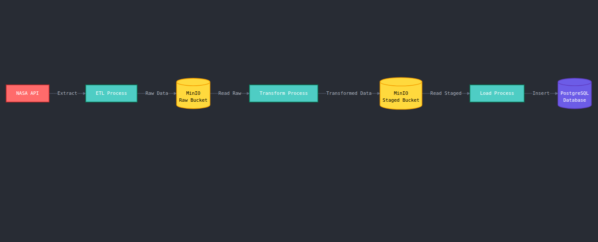

### Why This Architecture?

**1. Separation of Raw and Staged Data (Medallion Architecture Light)**
- **Raw Layer (Bronze)**: Preserves original API responses unchanged
  - Allows reprocessing if transformation logic changes
  - Serves as audit trail and disaster recovery point
  - No data loss if bugs exist in transformation code
- **Staged Layer (Silver)**: Contains cleaned, validated data
  - Only necessary fields kept (`date`, `title`, `explanation`, `url`)
  - Ready for loading without re-transformation
  - Acts as quality gate before warehouse

**2. Why MinIO as Data Lake?**
- **S3-Compatible**: Skills transfer directly to AWS S3, Azure Blob, GCS
- **Cost-Effective**: Free local storage vs. cloud costs during development
- **Decouples Storage from Compute**: Can scale independently
- **Object Storage Benefits**: 
  - Immutable data (write-once, read-many)
  - Easy versioning and partitioning by date
  - No need for database connections during extract/transform

**3. Why PostgreSQL as Warehouse?**
- **Analytics-Ready**: SQL interface for BI tools, analysts, and dashboards
- **Structured Schema**: Enforces data quality with constraints
- **Query Performance**: Indexed queries faster than scanning JSON files
- **ACID Compliance**: Guarantees data integrity for downstream consumers

**4. Why Apache Airflow?**
- **Orchestration**: Manages task dependencies (Extract → Transform → Load)
- **Scheduling**: Handles daily incremental loads automatically
- **Retry Logic**: Auto-retries failed tasks with exponential backoff
- **Monitoring**: Visual DAG interface shows pipeline health
- **Backfill Capability**: Can replay historical data without code changes

---

## Project Structure
```
airflow-nasa-apod/
│── dags/
│   ├── nasa_apod_pipeline.py     # Daily scheduled DAG
│   ├── nasa_apod_backfill.py     # One-off backfill DAG
│   └── pipelines/
│       └── nasa_apod/
│           ├── extract.py        # Extract from NASA API → MinIO
│           ├── transform.py      # Transform JSON → staged data
│           ├── load.py           # Load staged → Postgres
│           └── README.md
│── .env
│── .gitignore
│── README.md
```

### Structure Rationale
- **Modular Scripts**: Each ETL step is isolated for testing and reusability
- **Pipelines Directory**: Organizes multi-DAG projects (scalable for future APIs)
- **Environment Variables**: Secrets (API keys, DB passwords) never committed to Git

---

## ETL Scripts

### **1. Extract** (`extract.py`)
**What it does:**
- Calls NASA API with your API key
- Saves raw JSON into **MinIO bucket** (`nasa-apod-dl/raw/`)

**Why this approach:**
- **API Key Security**: Uses environment variables, not hardcoded values
- **Raw Data Preservation**: Keeps entire API response (including fields we don't use yet)
- **Idempotency**: Can re-run safely; overwrites same file if date already exists
- **Partitioning**: Files named by date (`raw/2024-01-15.json`) for easy lookups

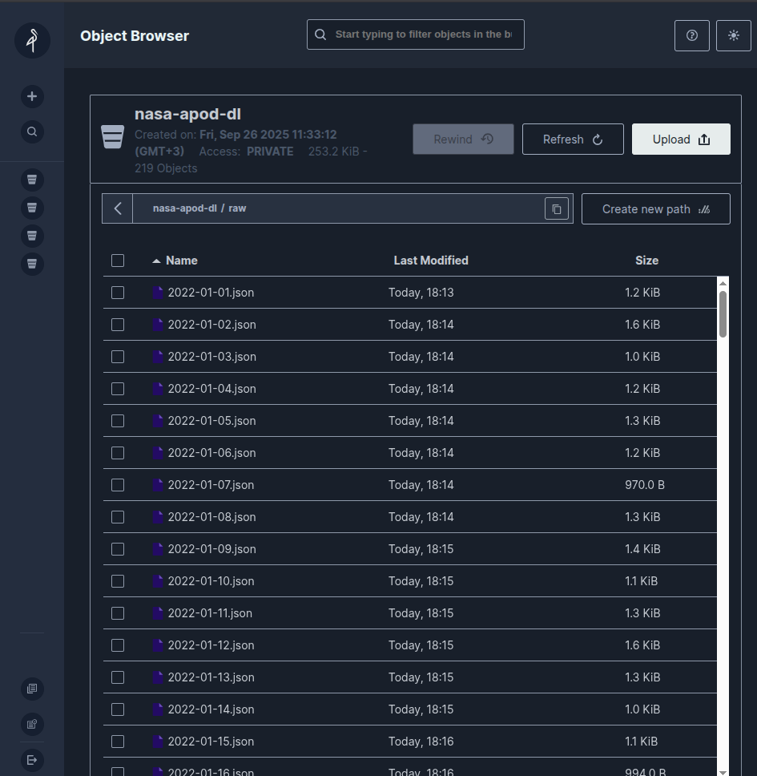

---

### **2. Transform** (`transform.py`)
**What it does:**
- Reads raw JSON from MinIO
- Keeps only: `date`, `title`, `explanation`, `url`
- Writes to **MinIO staged path** (`nasa-apod-dl/staged/`)

**Why this approach:**
- **Field Selection**: Removes unnecessary metadata (`service_version`, `copyright`, etc.)
- **Data Validation**: Can add checks (e.g., URL format, non-null title)
- **Schema Evolution**: If we need more fields later, raw data still exists
- **Separation of Concerns**: Transform logic is independent of extract/load

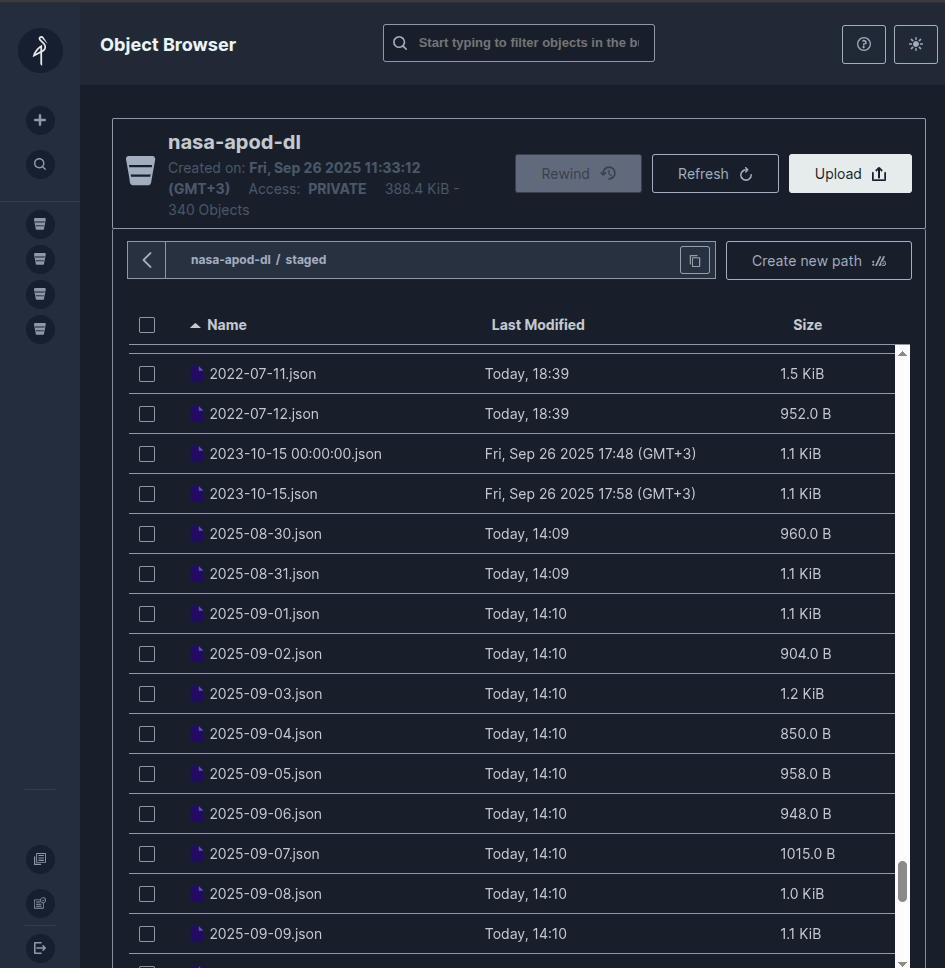

---

### **3. Load** (`load.py`)
**What it does:**
- Reads staged JSON from MinIO
- Inserts into PostgreSQL (table: `apod_records`)

**Why this approach:**
- **Bulk Inserts**: Can batch multiple records for performance
- **Upsert Logic**: Use `ON CONFLICT DO UPDATE` to handle re-runs (idempotency)
- **Error Handling**: Failed inserts don't corrupt MinIO data (can retry)


---

## Airflow DAGs

### **Daily DAG** (`nasa_apod_pipeline.py`)
- Runs once per day (`@daily` schedule)
- Workflow: Extract → Transform → Load

**Why `@daily`?**
- NASA publishes one APOD per day at midnight EST
- Airflow's `@daily` runs at midnight UTC (adjust `schedule_interval` if needed)
- Catches up automatically if Airflow was down (controlled by `catchup` parameter)

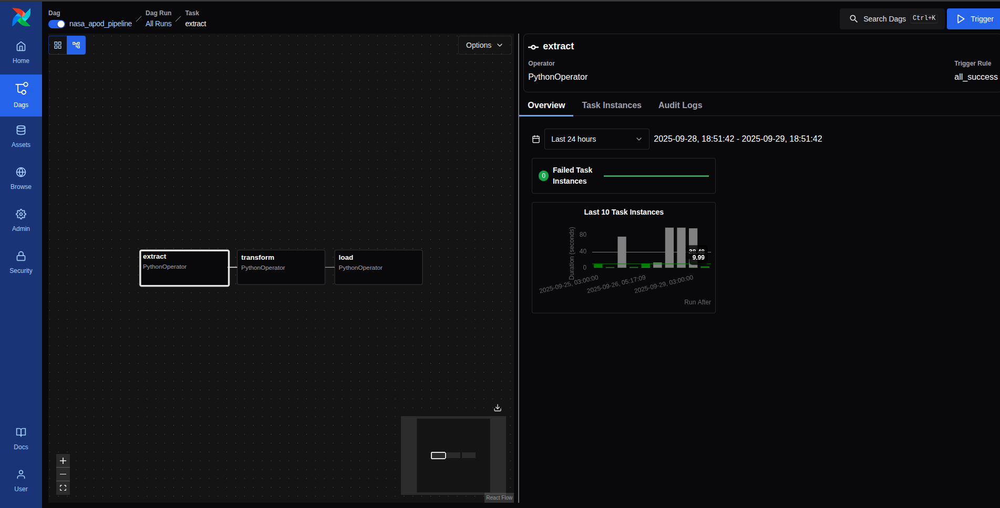

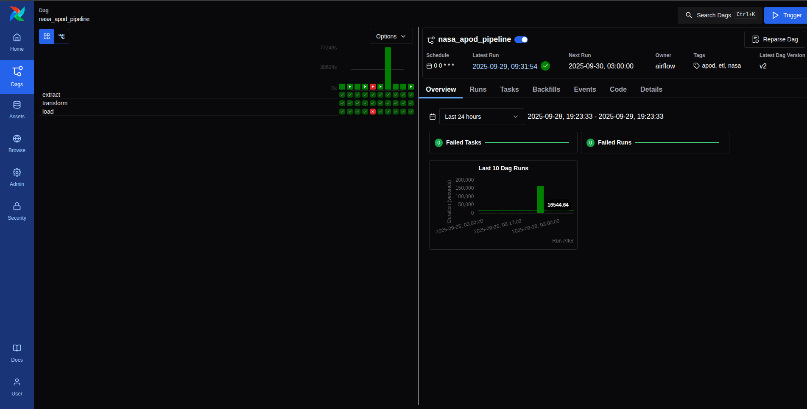

---

### **Backfill DAG** (`nasa_apod_backfill.py`)
- Triggered manually from Airflow UI
- Accepts JSON config for date range:
```json
{
  "start_date": "2022-01-01",
  "end_date": "2022-12-31"
}
```
- Loops over the range, loads all data

**Why a Separate Backfill DAG?**
- **Manual Control**: Large backfills shouldn't run automatically
- **Rate Limiting**: NASA API limits requests; backfill can add delays between calls
- **Config Flexibility**: Different parameters (batch size, concurrency) than daily runs
- **Resource Management**: Prevents overwhelming MinIO/Postgres during bulk loads

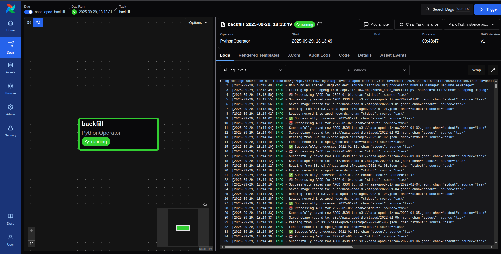

---

## Analytics-Ready Data

The final table in Postgres (`apod_records`) enables:
- **SQL Queries**: `SELECT * FROM apod_records WHERE date BETWEEN '2023-01-01' AND '2023-12-31'`
- **BI Tool Integration**: Connect Tableau, Power BI, Metabase directly
- **Data Science**: Export to Pandas for NLP on `explanation` text
- **API Layer**: Build Flask/FastAPI to serve data to frontend

**Sample Queries:**
```sql
-- Most common words in titles
SELECT title, COUNT(*) FROM apod_records GROUP BY title ORDER BY COUNT(*) DESC LIMIT 10;

-- Videos vs Images
SELECT media_type, COUNT(*) FROM apod_records GROUP BY media_type;

-- Longest explanations
SELECT date, title, LENGTH(explanation) as length 
FROM apod_records ORDER BY length DESC LIMIT 5;
```

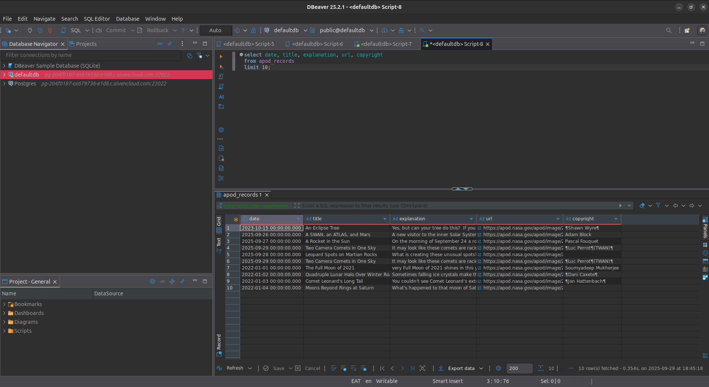

---

## Lessons Learned & Design Decisions

### What Went Right
1. **Modular Code**: Each ETL step can be tested independently
2. **Data Lake Pattern**: Raw data preservation enables reprocessing
3. **Idempotency**: Re-running pipelines doesn't duplicate data
4. **Separation of Concerns**: Extract doesn't know about Postgres; Load doesn't know about NASA API

### What Could Be Improved
1. **Data Quality Checks**: Validate URLs, check for null values before loading
2. **Monitoring**: Add Airflow SLAs to alert if DAG takes too long
3. **Testing**: Unit tests for transform logic, integration tests for full pipeline

---

## Future Work

### Short-Term (1-2 weeks)
- Full backfill (1995-06-16 → today, ~11k records)
- Add `media_type` column to distinguish images from videos
- Implement proper logging (Python `logging` module)

### Medium-Term (1 month)
- Streamlit dashboard to visualize APOD images interactively
  - Filter by date range, search by keyword in title/explanation
  - Display image thumbnails in grid view
- Airflow alerts (email/Slack on failure)
- Add dbt for transformation testing and documentation

### Long-Term (3+ months)
- Migrate to AWS (S3 + Redshift) or GCP (GCS + BigQuery)
- NLP Analysis: Topic modeling on 30 years of astronomy explanations
- CDC (Change Data Capture) if NASA updates old records
- Dockerize entire stack (Dockerized every stack except for MinIO that I'm running on host)

---

## Conclusion

This project demonstrates a **production-grade ETL pipeline**:
- **Orchestrated**: Airflow manages dependencies, scheduling, retries
- **Scalable**: Data lake → Warehouse pattern supports millions of records
- **Maintainable**: Modular scripts, version-controlled, documented
- **Reproducible**: Anyone can clone and run with `.env` file

**Not just a toy project** — analysts can query 30 years of astronomy pictures with SQL today. Skills learned here transfer directly to enterprise data engineering roles (Airflow, S3, data warehouses).

**Key Takeaway**: Good data architecture isn't about complexity; it's about:
1. Preserving raw data (reprocessing flexibility)
2. Separating concerns (modularity)
3. Making data accessible (SQL warehouse)
4. Automating reliably (Airflow orchestration)

---

## Results & Validation
- **DBeaver SQL Query Screenshot**
The SQL I've run in DBeaver this morning(October 2, 2025) to check the previous day APOD and it's output:
```sql
SELECT date, title, explanation, url
FROM apod_records
WHERE date::date = '2025-10-01';
```

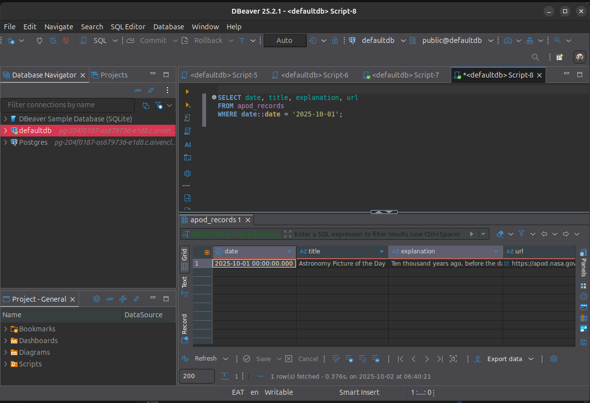

- **The Actual Picture Screenshot**
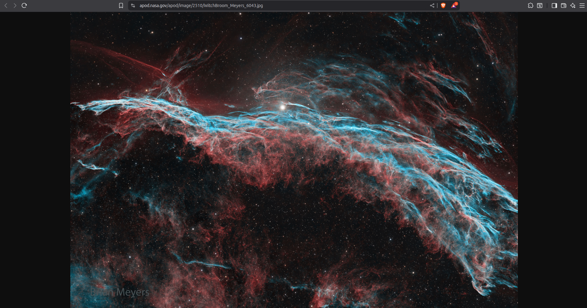

- **Airflow Pipeline Screenshot**
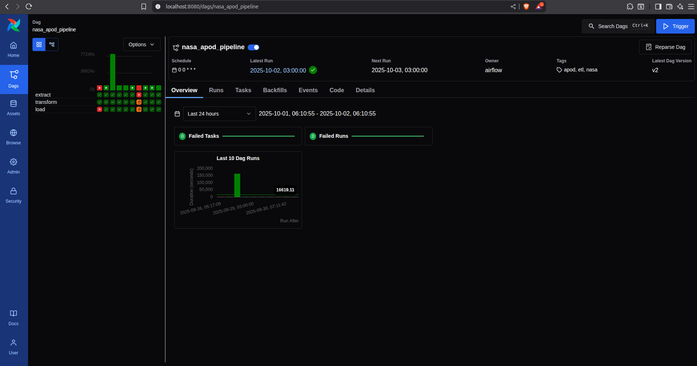


## Setup Instructions

The project runs on a fully containerized stack using Docker:

- **Airflow Scheduler / Webserver / Worker** (Docker containers)
- **Postgres** (for Airflow metadata + APOD records)
- **Redis** (Celery message broker)
- **MinIO** (S3-compatible data lake, runs locally or can be dockerized)

### Prerequisites
- Docker & Docker Compose installed
- Python 3.12 (for local testing scripts)
- NASA API KEY

### Run the Stack
From the `~/airflow-docker` folder:

```bash
docker-compose up -d

### Prerequisites
- Docker & Docker Compose
- Python 3.9+
- NASA API Key (free at https://api.nasa.gov)

### Quick Start
```bash
# 1. Clone repository
git clone <your-repo-url>
cd airflow-nasa-apod

# 2. Create .env file
cat > .env << EOF
NASA_API_KEY=your_key_here
POSTGRES_USER=airflow
POSTGRES_PASSWORD=airflow
POSTGRES_DB=airflow
MINIO_ROOT_USER=minioadmin
MINIO_ROOT_PASSWORD=minioadmin
EOF

# 3. Start services
docker-compose up -d

# 4. Access UIs
# Airflow: http://localhost:8080 (admin/admin)
# MinIO: http://localhost:9001 (minioadmin/minioadmin)
```
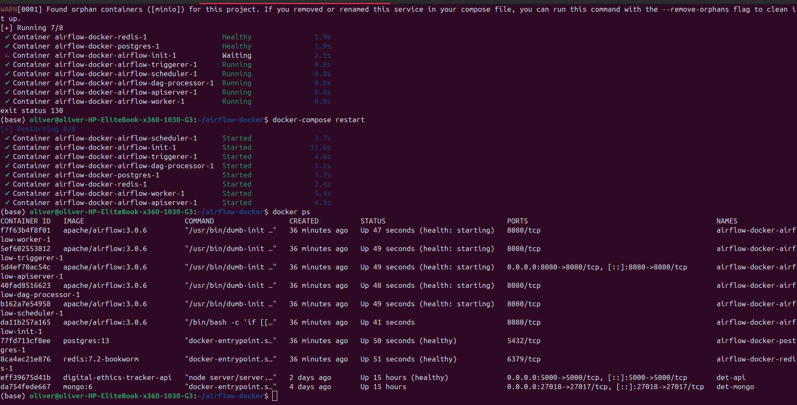

### Manual Testing
```bash
# Test extract
python dags/pipelines/nasa_apod/extract.py

# Test transform
python dags/pipelines/nasa_apod/transform.py

# Test load
python dags/pipelines/nasa_apod/load.py
```

---

## References
- [NASA APOD API Docs](https://api.nasa.gov)
- [Apache Airflow Best Practices](https://airflow.apache.org/docs/apache-airflow/stable/best-practices.html)
- [MinIO Documentation](https://min.io/docs/minio/linux/index.html)
- [Medallion Architecture (Databricks)](https://www.databricks.com/glossary/medallion-architecture)